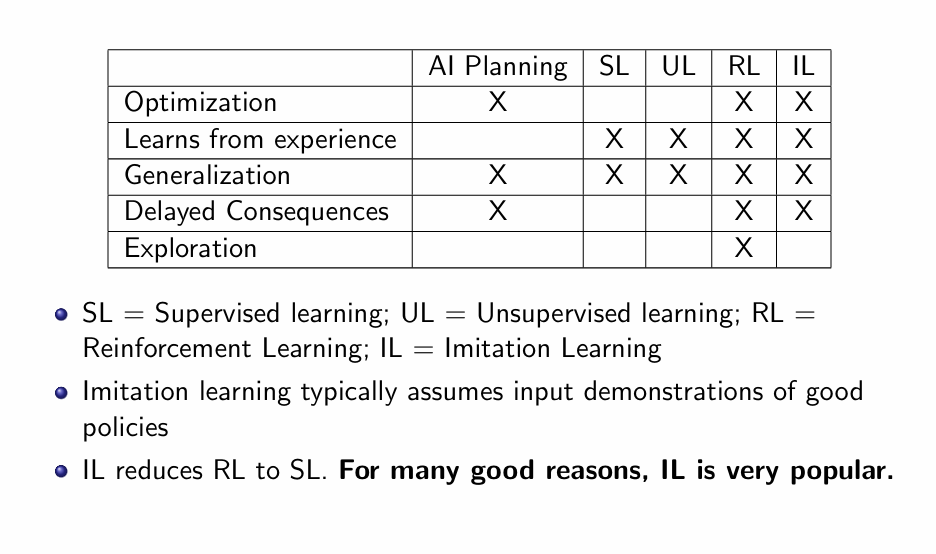
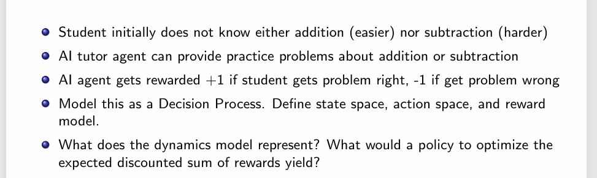
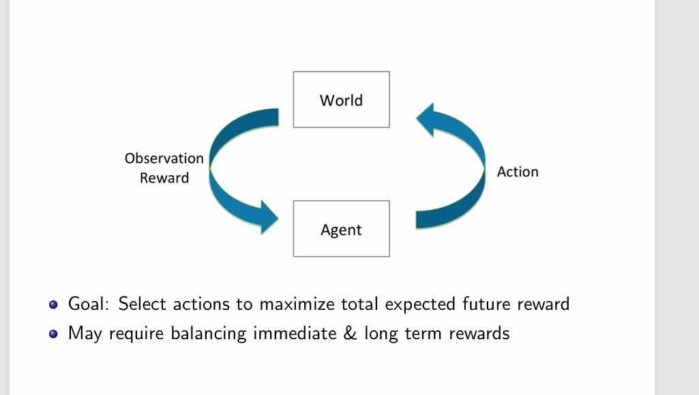
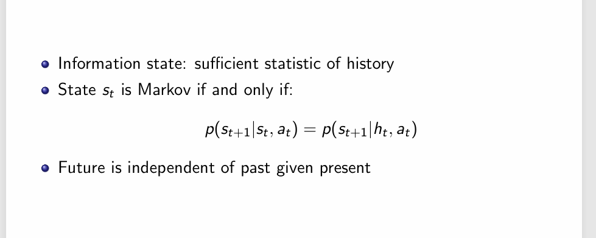
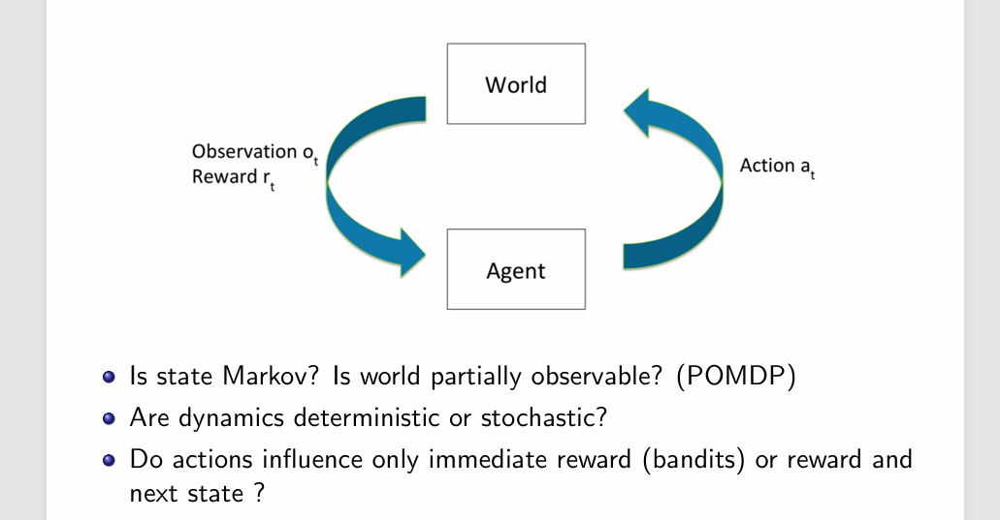
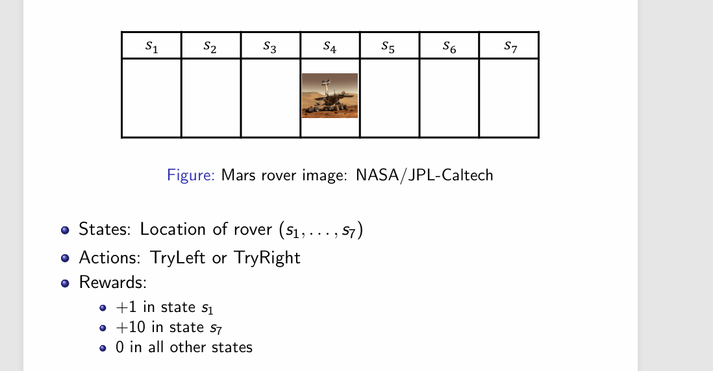

# 强化学习简介
强化学习是一种机器学习范式，它通过与环境的交互来学习如何在给定状态下采取行动，以最大化累积奖励。与其他类型的学习方法不同，强化学习不依赖于大量的标注数据，而是通过试错的方式来探索最优策略。

IL有一点像知识蒸馏，IL的目的是对一个已经存在的好的决策进行学习，以符合人类的价值观。但是相比于强化学习，它缺少了探索，也就是说，它不可能做出比人类更好的决策。这也是强化学习的**核心目标**。 
第一个指标Optimization指的是模型来判断某个东西**好不好**，而不是判断一个东西**是不是**。
# 一个简单的例子

**状态空间（state space）：**学生的能力值，可以用数字来表示：比方说加法的能力值是0.9，减法的能力值是0.4。也可以用一个浏览记录来表示，里卖弄存储着agent已经出过的题。
**动作空间（action space）**agent出加法题还是减法题。
**奖励模型（reword model）**学生答对问题加1分，答错问题减1分。

**很明显，图中给定的奖励模型不合理，因为这样会让模型只想出简单题。**

# 马尔可夫决策

如何判断一个状态是具有马尔可夫的性质？

一个满足马尔可夫性质的例子。

