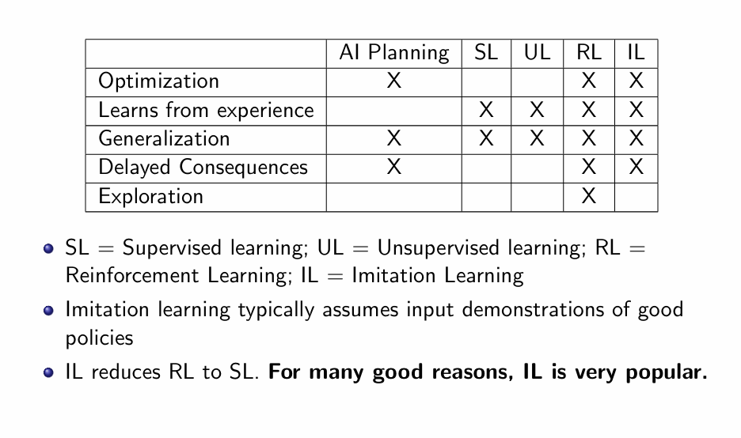
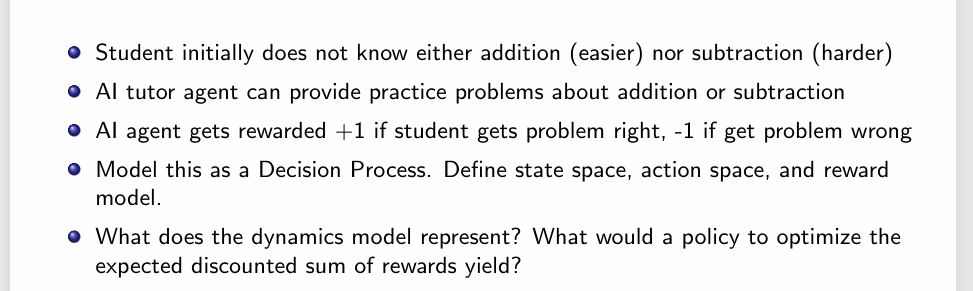
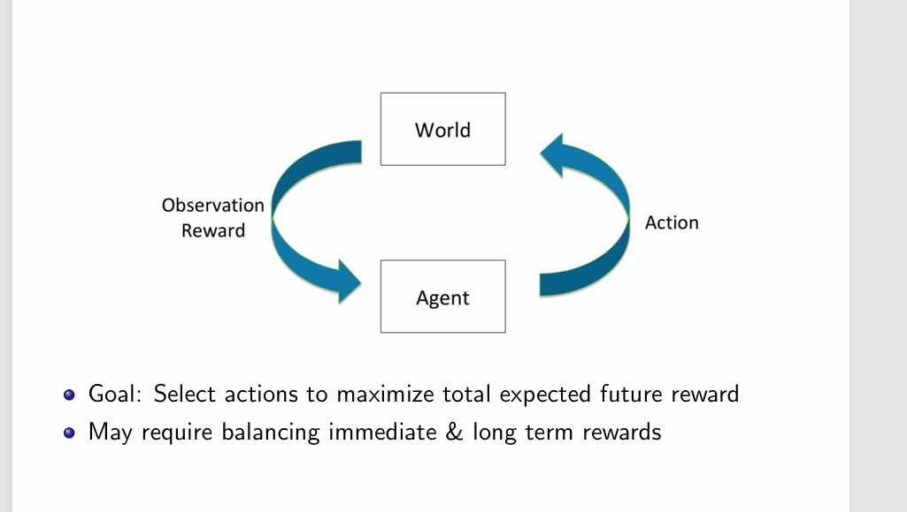
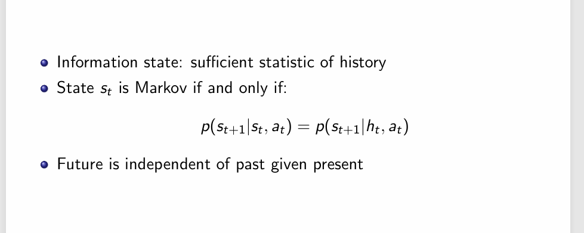
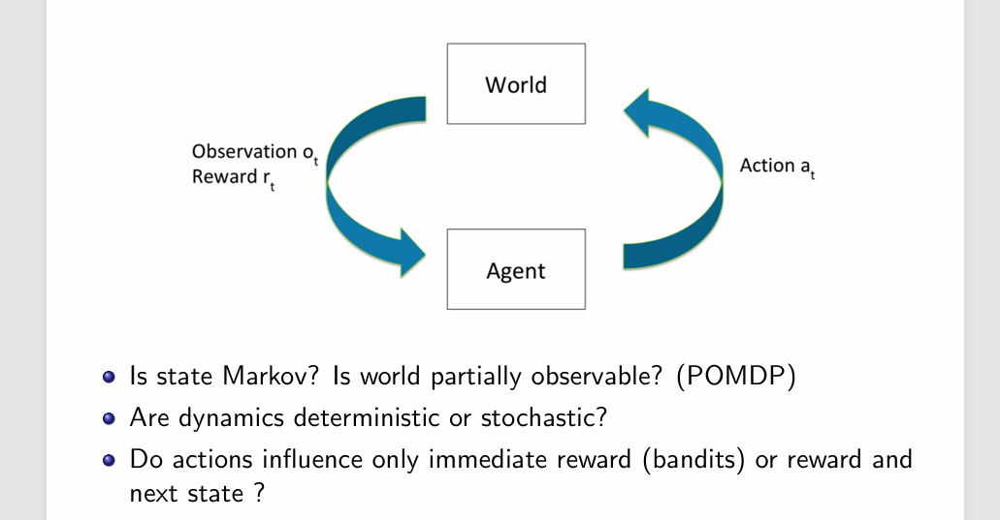
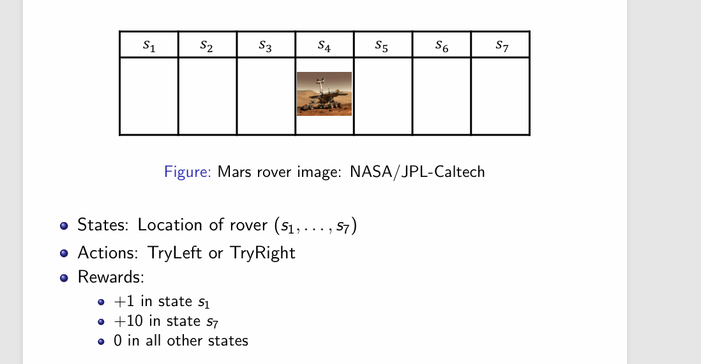
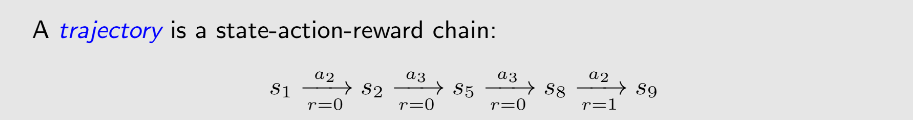
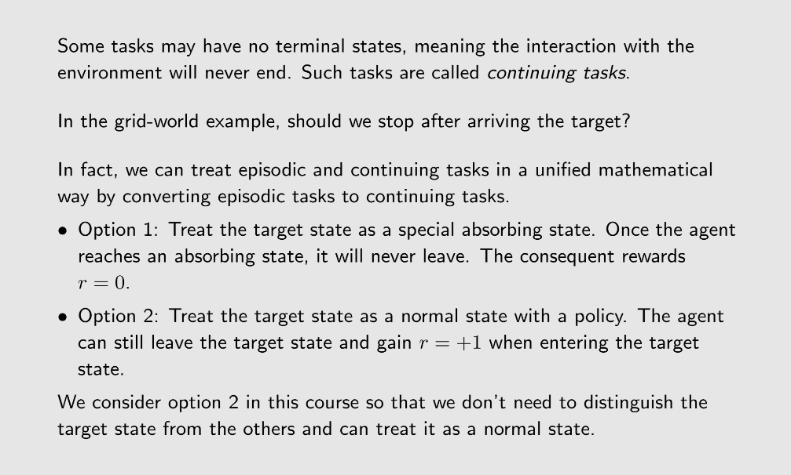

# 强化学习简介
强化学习是一种机器学习范式，它通过与环境的交互来学习如何在给定状态下采取行动，以最大化累积奖励。与其他类型的学习方法不同，强化学习不依赖于大量的标注数据，而是通过试错的方式来探索最优策略。

IL有一点像知识蒸馏，IL的目的是对一个已经存在的好的决策进行学习，以符合人类的价值观。但是相比于强化学习，它缺少了探索，也就是说，它不可能做出比人类更好的决策。这也是强化学习的**核心目标**。 
第一个指标Optimization指的是模型来判断某个东西**好不好**，而不是判断一个东西**是不是**。
# 一个简单的例子

**状态空间（state space）：**学生的能力值，可以用数字来表示：比方说加法的能力值是0.9，减法的能力值是0.4。也可以用一个浏览记录来表示，里卖弄存储着agent已经出过的题。
**动作空间（action space）**agent出加法题还是减法题。
**奖励模型（reword model）**学生答对问题加1分，答错问题减1分。

**很明显，图中给定的奖励模型不合理，因为这样会让模型只想出简单题。**

# 马尔可夫决策

如何判断一个状态是具有马尔可夫的性质？

一个满足马尔可夫性质的例子。

# 几个重要概念

## Action Space
动作空间是指在每个状态下，智能体可以选择的所有可能动作的集合。动作空间可以是离散的（有限个动作）或连续的（无限个动作）。例如，在一个棋类游戏中，动作空间可能包括所有合法的棋步；而在一个机器人控制任务中，动作空间可能包括所有可能的运动方向和速度。

## Policy
策略是指智能体在每个状态下选择动作的规则或函数。策略可以是确定性的（给定状态总是选择同一动作）或随机性的（给定状态以一定概率选择不同动作）。

## deterministic Policy
确定性策略是指在每个状态下，智能体总是选择同一动作的策略。它可以用一个函数来表示，该函数将状态映射到一个具体的动作。

## stochastic Policy
随机策略是指在每个状态下，智能体以一定的概率选择不同的动作的策略。它可以用一个概率分布来表示，该分布描述了在给定状态下选择每个动作的概率。

## Reward
奖励是指智能体在执行某个动作后，从环境中获得的反馈信号。奖励可以是正数（表示好的结果）或负数（表示不好的结果）。智能体的目标是最大化累积奖励。

**注意：Reward由当前状态和在这个状态下做出的action决定，而不是由下一个状态决定的。**

## Traejectory
轨迹是指智能体在与环境交互过程中经历的一系列状态、动作和奖励的序列。轨迹可以用来评估策略的性能，并用于训练强化学习模型。

## Return
回报是指智能体在某个时间点开始，未来所有奖励的累积和。回报可以用来评估策略的长期效果。通常，回报会考虑折扣因子（discount factor），以降低未来奖励的权重。一个Trajectory的回报就是指沿着Trajectory所指定的策略一直执行下去所能得到的总奖励(Sum of the **Reward**)。

## Episode
一个Episode是指智能体从初始状态开始，到达终止状态（或达到最大步数）为止的整个过程。在一个Episode中，智能体会经历一系列的状态、动作和奖励。Episode的长度可以是固定的，也可以是动态的，具体取决于任务的设计。

## Markov Decision Process (MDP) 与 Markov Process (MP)的区别
MP是做完决策的MDP。