# 马尔科夫决策过程（MDP）

对于MRP(Markov Reward Process)的几个公式：
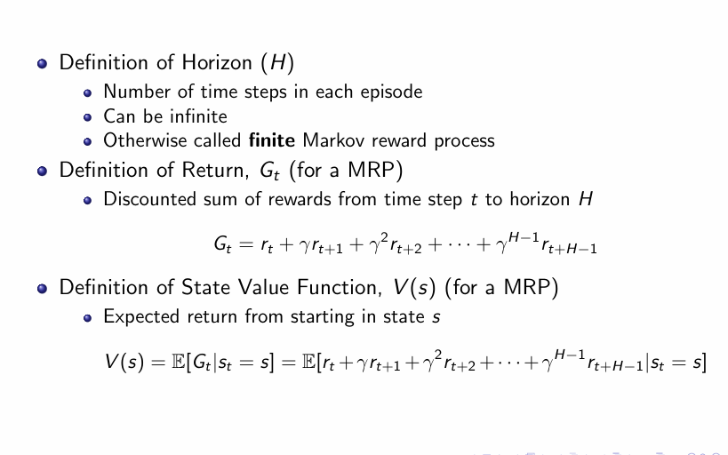

Value Function还可以转化为下面这个式子：
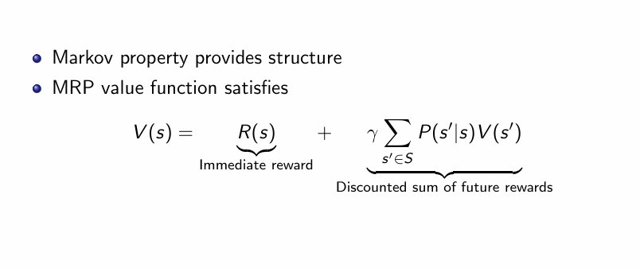

现在的目标求解Value Function，有两种方法可以解决这个问题：

- 1. 矩阵乘法直接计算，算法复杂度$O(n_3)$：
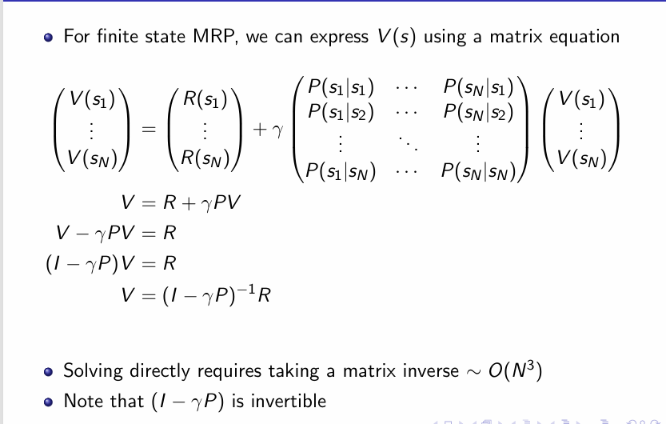

- 2. 动态规划求解，算法复杂度$O(n_2)$:
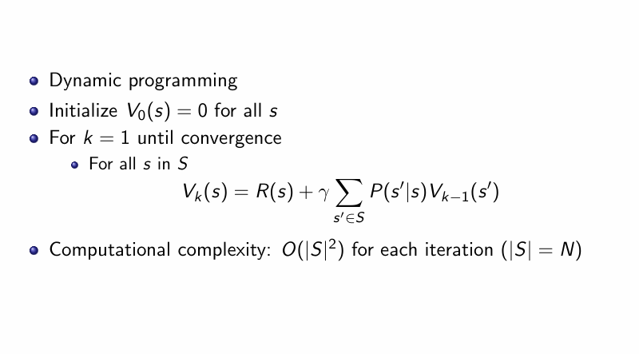
**注意：k为迭代次数，而不是时间戳**

## MDP组成结构

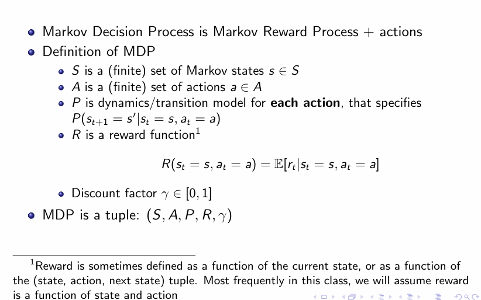

MDP + Policy
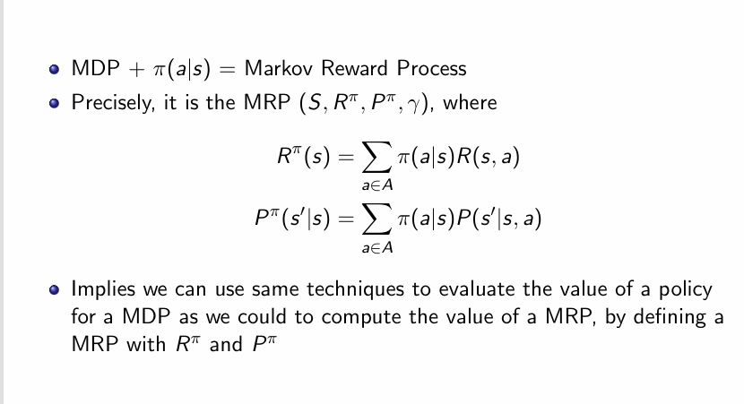

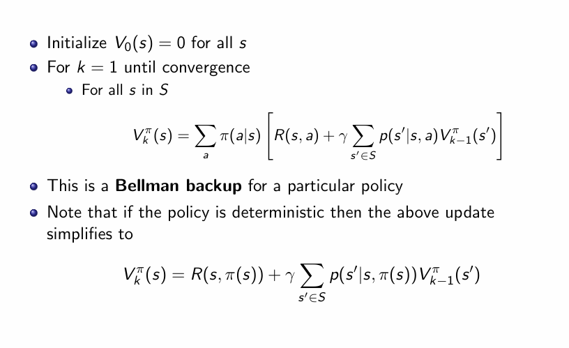

举一个例子来更加理解贝尔曼方程的形式：
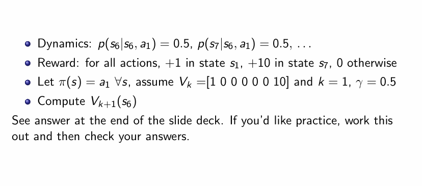
答案是2.5

## State-Action Function 
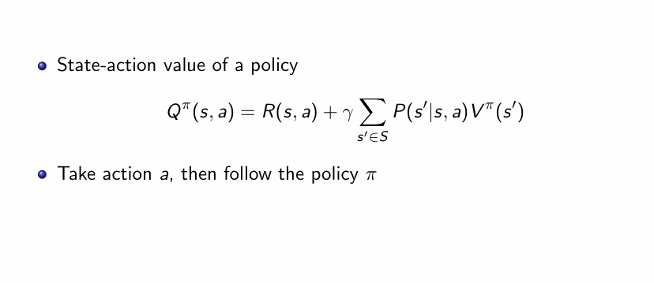
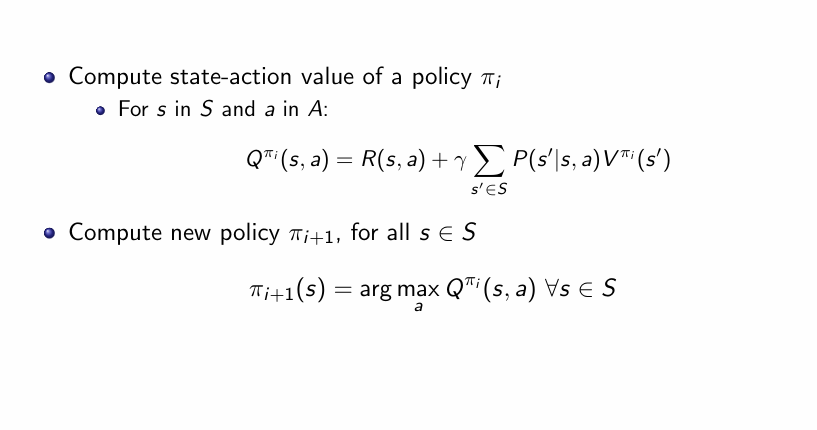

## Markov Policy Iteration
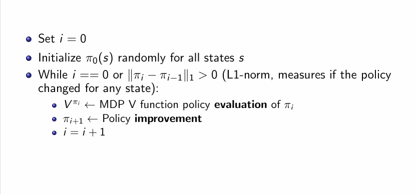

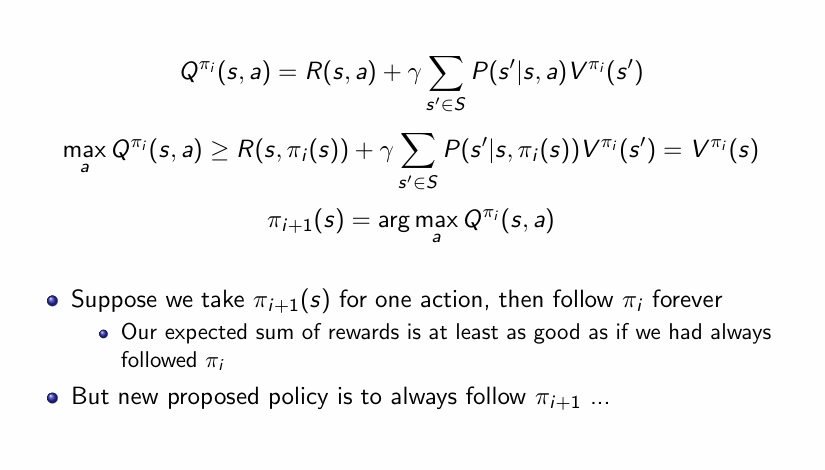
第二个公式的意思是：我在这一时间步使用的策略应该要比上一时间步策略使用的最优策略要更优。

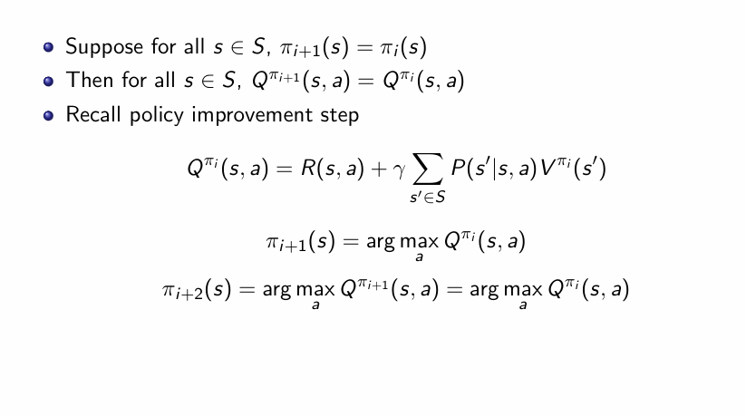

## Value Iteration

# 几个重要概念

## State Value
在策略$\pi$下的状态值函数$V_\pi(s)$表示从状态s开始，按照策略$\pi$所能获得的期望回报。
### Return与State Value的区别
Return是指从一个状态s开始，按照策略$\pi$所能获得的回报，而State Value是指从状态s开始，按照策略$\pi$所能获得的期望回报。换句话说，Return是一个具体的数值，而State Value是一个期望值。

## Bellman Equation
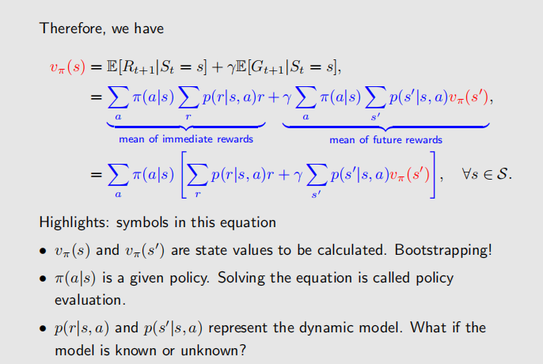

## Policy Evaluation
现在有一个策略，我们要评价这个策略的优劣，就可以使用Bellman Equation来计算State Value。

## 计算State Value

如果直接用线性代数的方法来计算State Value，复杂度是$O(n^3)$，其中n是状态的数量。

可以用一个迭代算法来近似计算State Value，复杂度是$O(n^2)$：
- 首先设定一个初始值$V_0(s)$，可以随机初始化，也可以设为0。
- 然后将其代入贝尔曼公式，并反复更新$V(s)$，直到收敛为止。更新公式为：
- 最后，当$V_k(s)$收敛时，就得到了State Value。
**可以证明，这个迭代算法是可以得到State Value的。**

## Action Value

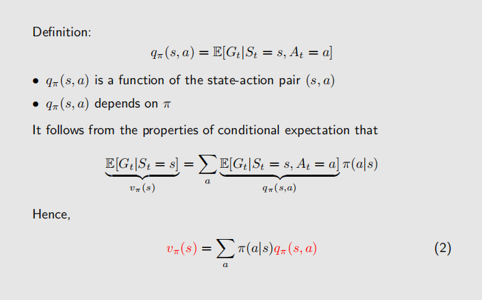