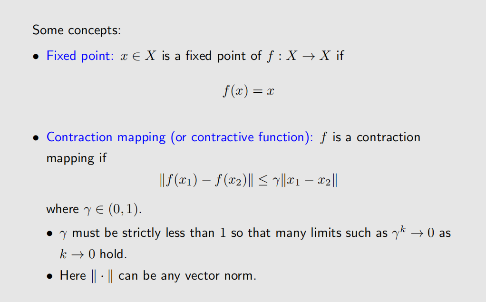

# Bellman Optimality Equation(BOE)
在有了贝尔曼方程后，我们可以通过迭代的方式来得给定策略下的State Value。但是如何来求解最优策略呢？这就需要用到Bellman Optimality Equation(BOE)。

求解这个方程可以从等式的右边入手，先将$V^*(s)$视为常量，将等式右边的最优策略先计算出来。具体来说，是对每一个状态计算一个Action Value $Q(s, a)$，然后贪婪地选择价值最大的动作作为策略。

在得到最优策略之后，我们可以通过迭代的方式来求解State Value。迭代的方法能成功的原因来自不动点原理：

这个定理告诉我们，如果一个函数具有一个不动点，那么它的迭代序列会收敛到这个不动点。对于我们的State Value函数来说，这个不动点就是State Value。

至此，解决BOE的统一范式如下：

最后是一些对于研究BOE的意义：
