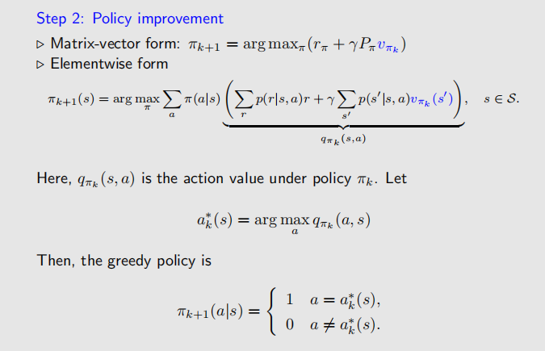

# Value Iteration
值迭代是以State Value为基础的，主要是通过迭代的方式来求解State Value。其核心思想是通过Bellman Equation来更新State Value，直到收敛为止。具体来说，值迭代的步骤如下：

1. 初始化State Value $V_0(s)$，可以随机初始化，也可以设为0。
2. Policy Update：根据$V_k(s)$来更新策略。
3. Value Update：根据当前策略来更新State Value $V_{k+1}(s)$。
4. 重复步骤2和3，直到State Value收敛为止。

# Policy Iteration
策略迭代是以Policy为基础的，主要是通过迭代的方式来求解最优策略。其核心思想是通过Policy Evaluation和Policy Improvement来更新策略，直到收敛为止。具体来说，策略迭代的步骤如下：
1. 初始化策略 $\pi_0(s)$，可以随机初始化，也可以设为一个固定的策略。
2. Policy Update根据当前策略 $\pi_k(s)$ 来计算State Value $V_{\pi_k}(s)$。
3. Policy Improvement根据State Value $V_{\pi_k}(s)$ 来更新策略 $\pi_{k+1}(s)$。

# Truncated Policy Iteration
截断策略迭代是对策略迭代的一种改进，主要是通过限制Policy Evaluation的迭代次数来加快收敛速度。所以在此之前，有必要比较一下Policy Iteration和Value Iteration的区别：

**它们最大的区别就是：值迭代将是将贝尔曼方程的求解过程与策略更新整合在一起的。；而策略迭代则是将贝尔曼方程计算完成之后再更新策略的。**  

而Truncated Policy Iteration则是将Policy Evaluation的迭代次数限制在一个固定的值$k$，这样可以加快收敛速度。这样做的好处是可以减少计算量，同时仍然能够得到一个近似的最优策略。具体来说，截断策略迭代的步骤如下：
1. 初始化策略 $\pi_0(s)$，可以随机初始化，也可以设为一个固定的策略。
2. Policy Update根据当前策略 $\pi_k(s)$ 来计算State Value $V_{\pi_k}(s)$，但只迭代$k$次，因此这里的State Value并不是真正的State Value。
3. Policy Improvement根据State Value $V_{\pi_k}(s)$ 来更新策略 $\pi_{k+1}(s)$。

