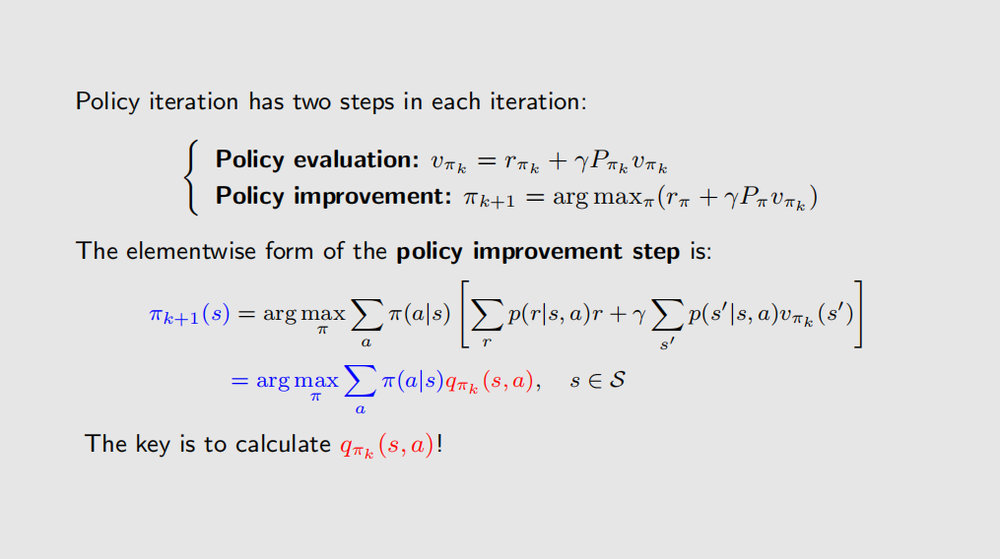
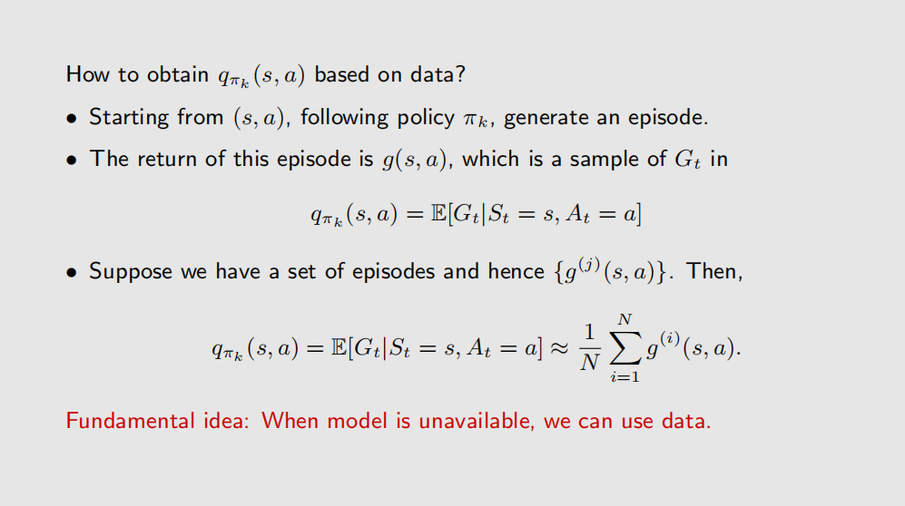
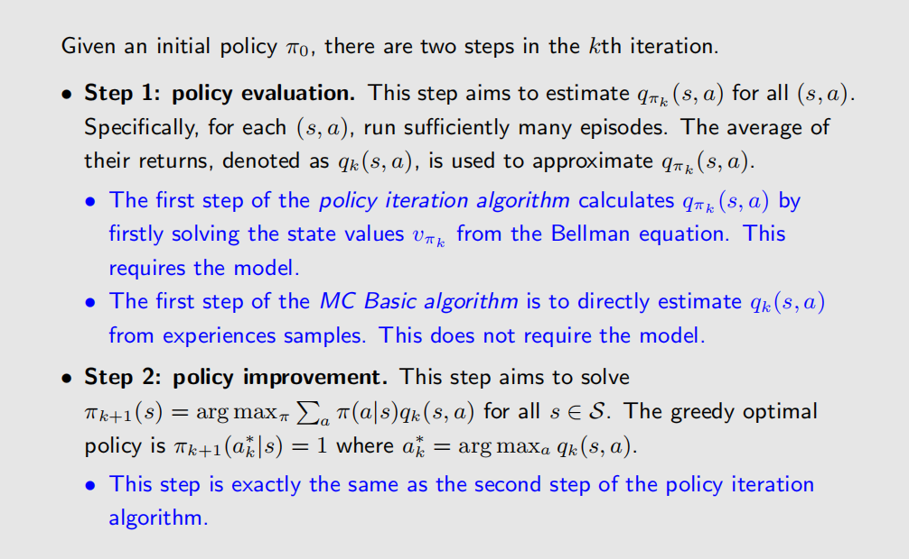
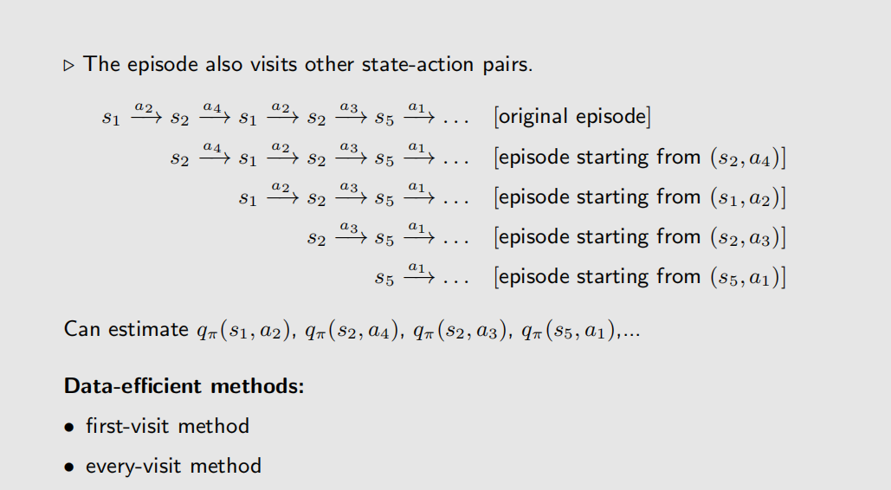
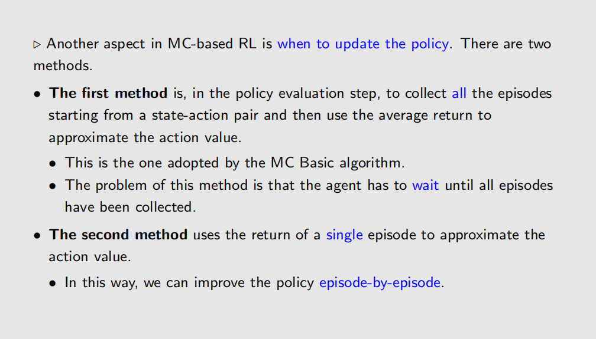
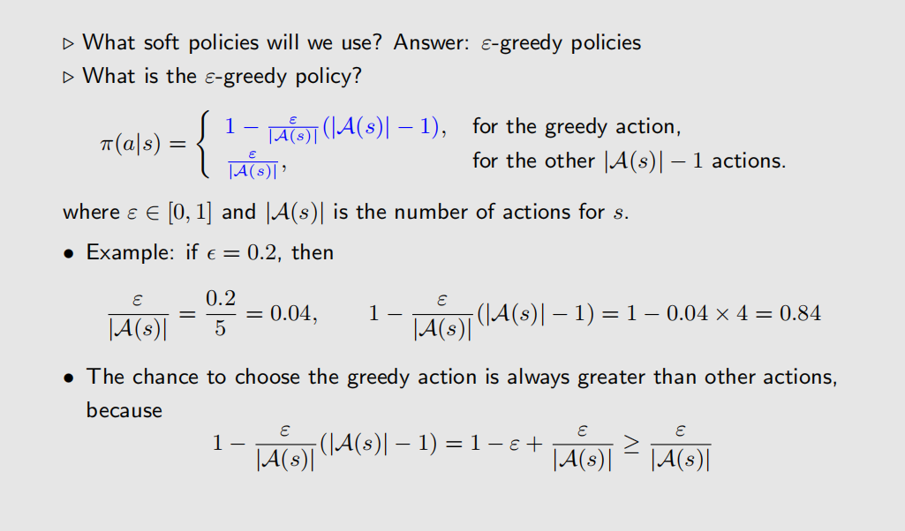
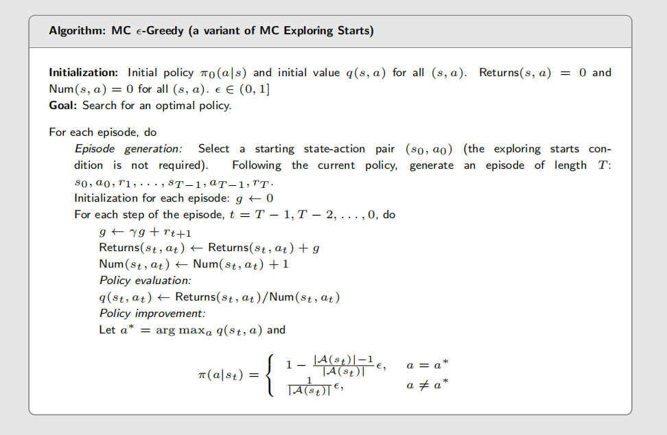

# Why Monte Carlo?
前面学习的值迭代和策略迭代都需要知道模型（transition probabilities），而现实中往往无法直接获得模型的概率分布，而是通常拥有大量数据（样本）。蒙特卡洛方法通过直接与环境交互来估计值函数和策略，而不需要知道环境的模型。
蒙特卡洛方法的理论基础是大数法则。大数法则表明，随着样本数量的增加，样本均值会收敛到期望值
# Monte Carlo Methods
蒙特卡洛方法是model-free的强化学习方法，它基于策略迭代的方法实现。
## MC Basic

由上图可知，现在的问题是使用蒙特卡洛方法来估计$q_{\pi_{k}}(s,a)$(data based)。

有了上述方法，我们就可以得到MC Basic的算法描述：

### The disadvantage of MC Basic
由于Monte Carlo Methods是model-free的方法，所以它需要收集所有state-action来进行估计，这在实际应用中可能会非常耗时和低效。

### The improvement of MC Basic

#### Use the date efficiently

一个episode往往回出现多个state-action对，所以我们可以使用这些state-action对来进行估计，而不是每次都从头开始计算。这样可以提高数据的利用效率。

对于这些state-action对，有两个访问方法：
- first-visit MC: 只使用第一次访问的state-action对进行估计。
- every-visit MC: 使用所有访问过的state-action对进行估计。

#### Use the value estimate efficiently

MC Basic的策略更新方法是：将一个state-action对采样的所有episodes计算完成之后，再对其取平均值来得到action-value函数的估计。
这种方法的缺点是需要等待所有episodes都完成之后才能进行更新，这在实际应用中可能会导致延迟。 
因此，我们可以使用state-action的一个episode来直接进行更新，这样就可以做到策略的在线更新。这与深度学习中采样的小批量（mini-batch）更新类似。

## MC Exploring Starts
为了不遗漏任何state-action对，MC Exploring Starts方法要求在每个episode开始时随机选择一个state-action对，这样可以确保所有state-action对都能被访问到。 
显而易见，这样会导致很多问题，如计算量过大、数据被浪费等。

## MC $\epsilon$-greedy

### Soft Policy
在MC Exploring Starts中，它的核心目的就是要让agent考虑所有的state-action对，从而尽量避免陷入局部最优解。为此，我们可以使用soft policy来实现。

soft policy的核心思想是：在每个state下，agent以一定的概率选择一个随机的action，而不是总是选择最优的action。这样可以确保在较长的一个episode中，agent在探索过程中不会遗漏任何state-action对。 

- 当$\epsilon$越小，agent越倾向于选择最优的action，也就是变得**exploitation**。
- 当$\epsilon$越大，agent越倾向于选择随机的action，也就是变得**exploration**。

**这里也就是强化学习的一个非常重要的问题，就是exploitation与exploration的权衡**。

有了MC $\epsilon$-greedy方法，我们就可以只使用一个较长eposide来对
所有的state-action来进行估计。
