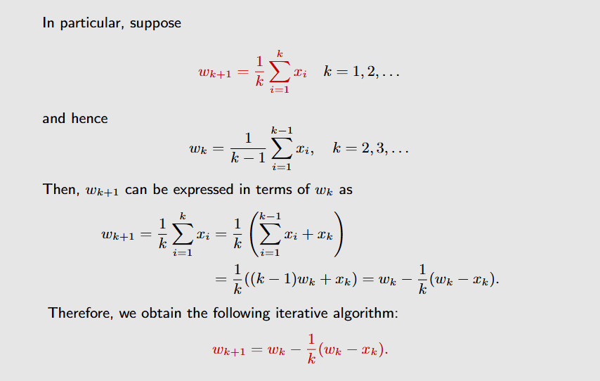
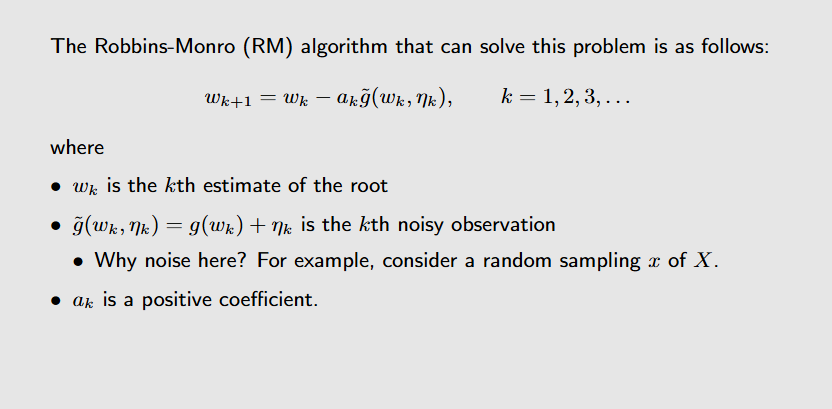
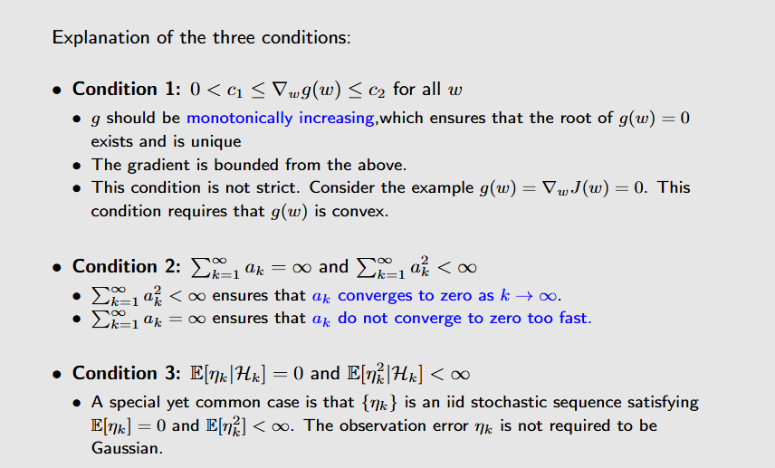
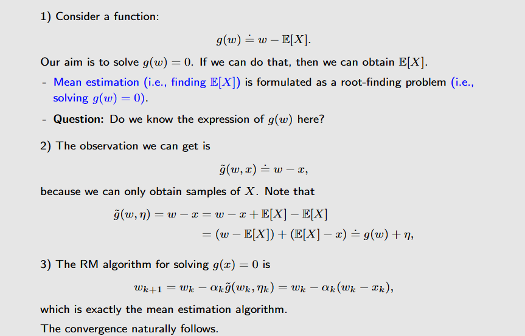
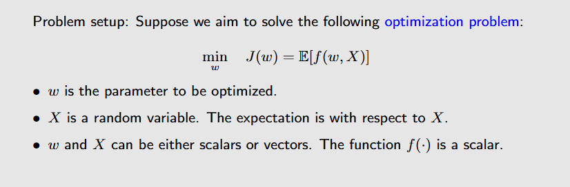
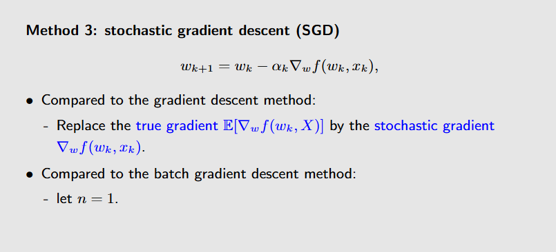
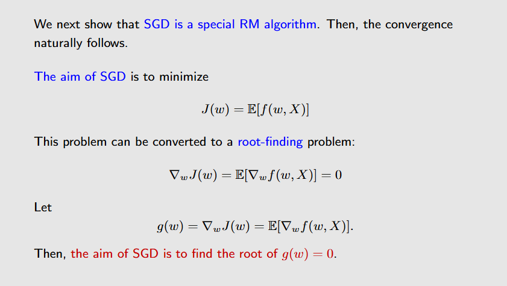
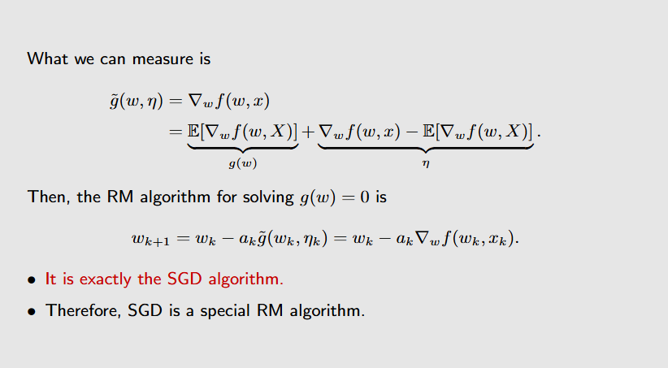
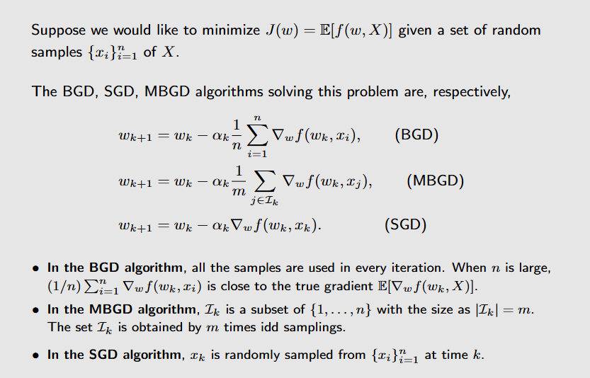

# 简介
这节课是理解temporal-difference algorithms的基础。主要介绍三个迭代算法：Mean Estimation; Robbins-Monro Algorithm; Stochastic Gradient Descent。

# Mean Estimation
这个算法要解决的问题是：我们想要求解一个随机变量$X$的期望值，我们通过对$X$进行多次采样来获得一组样本，传统的算法是对这些样本求平均值来估计$X$的期望值。
而Mean Estimation则采用一种增量式的迭代算法来求解$X$的期望值。

# Robbins-Monro Algorithm

## Stochastic Approximation
Stochastic Approximation是一系列随机迭代算法的统称，它的目标是在不知道一个函数的表达式的情况下来近似求解它的根。Robbins-Monro Algorithm便是Stochastic Approximation的一个开创性工作。

## Robbins-Monro Algorithm
Robbins-Monro Algorithm要求解这样一个问题：给一个函数$g(x)$，我们想要在不知道这个函数表达式的情况下找到一个$x$使得$g(x)=0$。
它给出的求解公式如下：

Robbins-Monro Algorithm收敛的三个条件：

经过下面的分析可以知道，Mean Estimation是Robbins-Monro Algorithm的一个特例。

# Stochastic Gradient Descent
随机梯度下降算法要解决这样一个问题：

先来看梯度下降算法的几个变种。
## Gradient Descent
Gradient Descent直接将$E(x)$代入梯度公式中，然后直接使用迭代算法求解。这样的问题是需要事先知道$E(x)$的表达式。
## Batch Gradient Descent
Batch Gradient Descent先对$E(x)$进行采样，得到一组样本，然后对这些样本求平均值来近似$E(x)$，再将这个近似值代入梯度公式中进行迭代。
这样的问题是需要采集大量的样本来近似$E(x)$，而且每次迭代都需要对所有样本进行计算，计算量较大。
## Stochastic Gradient Descent

与Batch Gradient Descent不同，Stochastic Gradient Descent每次迭代只使用一个样本来近似$E(x)$，这样可以大大减少计算量。
此外，可以证明Stochastic Gradient Descent同样也是Robbins-Monro Algorithm的一个特例。因此，它会满足Robbins-Monro Algorithm的收敛条件。

## BGD VS MBSD VS SGD

**注意，当MBGD抽取样本的数量与BGD相同时，这两种算法还是不同的，因为MBSD每一次抽取都满足独立同分布的性质，因此它可能会抽取一个样本不止一次或者不抽取。**