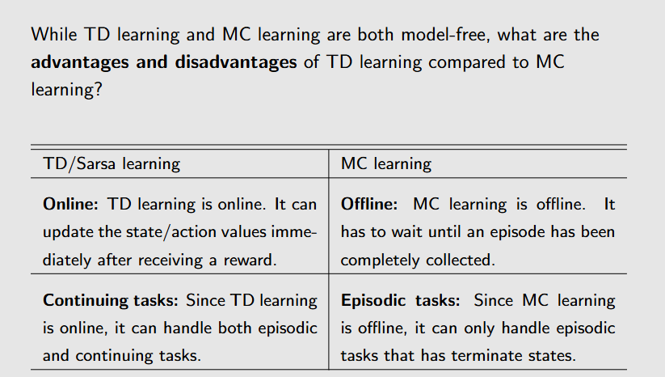

# Tempral Difference Learning
之前学习的蒙特卡洛算法有一个这样的问题，它需要等到一个episode结束后才能更新状态值函数，这样会导致学习的效率很低。Temporal Difference Learning（时序差分学习）则是解决这个问题的一种方法。它通过一个增量的方法来对迭代求解状态值函数进行更新。

实际上，TD Learning就是使用RM算法来求解贝尔曼方程。 

# TD Learning与MC Learning的区别

这两种算法的优缺点

# SARSA
因为TD Learing只能计算状态值函数，而不能计算动作值函数。SARSA（State-Action-Reward-State-Action）就是这样一种可以计算动作值函数。它的更新公式为：

可以发现，SARSA的迭代公式与TD Learing的公式非常相似。可以说SARSA是action value版本的TD Learning。
SARSA的伪代码如下所示：

# Expected SARSA

# n-step SARSA

可以发现，这三个算法之间的关系与之前的值迭代、策略迭代、Truncated 策略迭代的关系非常相似。n-step SARSA可以看作是SARSA的一个变种，它通过使用n步的回报来更新动作值函数。

# Q-learning
Q-Learning同样也是TD Learning算法的一个变种，它想要通过RM算法直接求解贝尔曼最优公式：

## on-policy v.s. off-policy
在TD Learning中，通常会存在两种策略，一种是behavior policy（行为策略），另一种是target policy（目标策略）。行为策略是用来生成数据的策略，而目标策略则是用来更新状态值函数或动作值函数的策略。 
而如果行为策略和目标策略是相同的，那么就称为on-policy；如果行为策略和目标策略不同，那么就称为off-policy。 
- Q-Learning**可以**是一种off-policy的算法，因为Q-Learning使用的行为策略和目标策略不一致。
- SARSA与MC则是一种on-policy的算法，因为SARSA使用的行为策略和目标策略是一致的。
具体解释可以看ppt理解 
因此，Q-Learning算法有两个版本，一个版本是on-policy的，一个版本是off-policy的。伪代码如下图 

这两种版本的区别就是在更新策略是使用Greedy策略还是使用ε-greedy策略。 

## Unfied View of TD Learning

