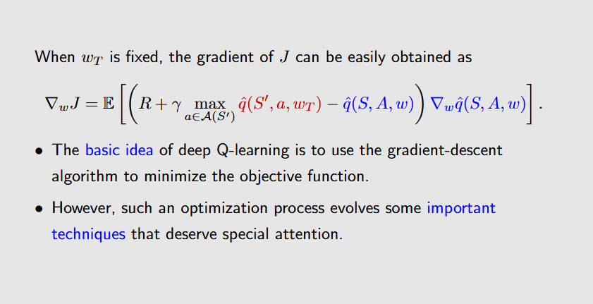

# Table-Based Learning的缺点

基于这个缺点，我们就想用value function approximation来解决这个问题。

# Value Function Approximation
Value Function Approximation需要设计一个目标函数来拟合Q值函数。

在具体任务中，不同的状态一般具有不同的重要性，因此我们需要对不同的状态赋予不同的权重。

$d_{\pi}$的计算可以用线性代数求特征向量的方法来求解。

## 求解目标函数
目标函数的求解可以用梯度下降法来求解。

到目前为止，这个梯度下降的公式还不能通过代码实现，因为在策略$\pi$下的状态价值函数是不知道的。 
我们可以采用蒙特卡洛或者时序差分的方法来估计状态价值函数。 

实际上，Tabular Representation是Linear Function Approximation的一种特殊情况。 
具体可以看ppt理解(28-30)。

## The Summary of Value Function Approximation

## Sarsa and Q-learning with Value Function Approximation
这两个算法基本相似，都是将原始的算法与梯度下降算法结合起来。 
具体可以看ppt理解(46-51)。

# Deep Q-Learning
Deep Q-Learning是一种将神经网络与强化学习结合起来的方法，也是现在最常用的深度强化学习方法。 
不同于Linear Function Approximation，Deep Q-Learning使用神经网络来近似Q值函数。 

求解图中所示的方程同样也使用梯度下降法来求解，但是由于Q-Learning的公式中存在max操作，这会导致反向传播困难，因此需要一些技巧来完成神经网络的训练。

## Target Network and Main Network

这一算法的流程是，我先固定Target Network的参数，只对Main Network的参数进行更新。当迭代一定次数后，再将Main Network的参数复制到Target Network中。 

## Experience Replay

在Deep Q-Learning中，我们需要使用经验回放来打破数据之间的相关性，因此，当采集到数据后，我们并不直接使用训练网络，而是将数据存储到一个经验回放池中。当需要训练网络时，我们从经验回放池中随机采样一批数据来进行训练。 

DQN的伪代码如下：
