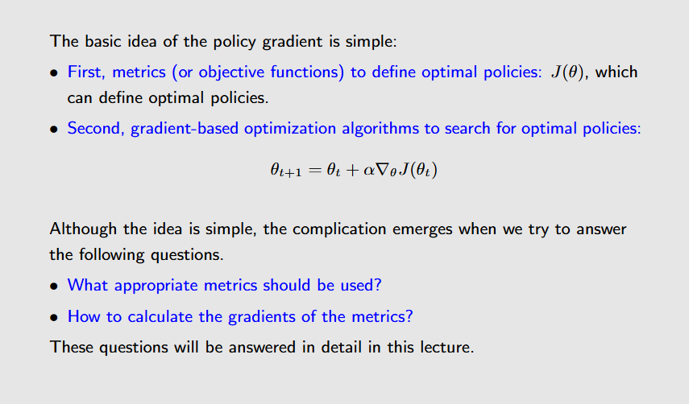
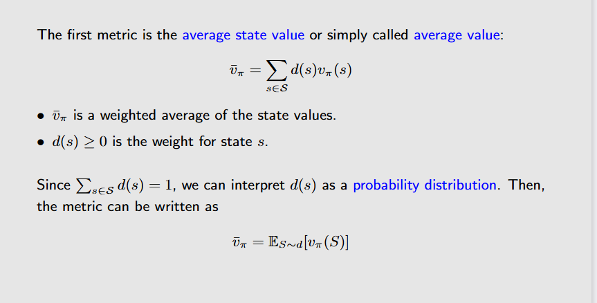
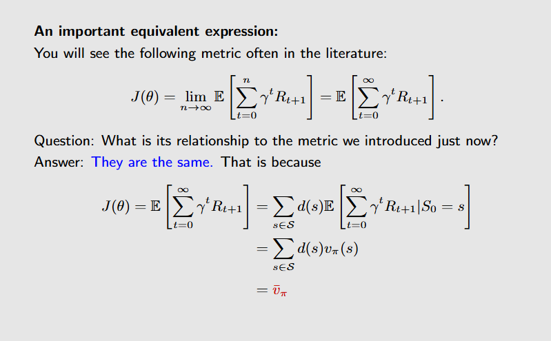
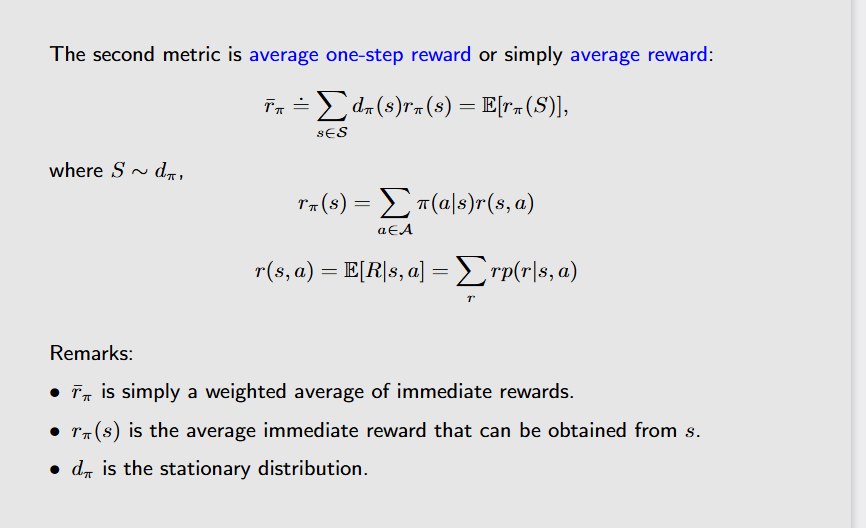
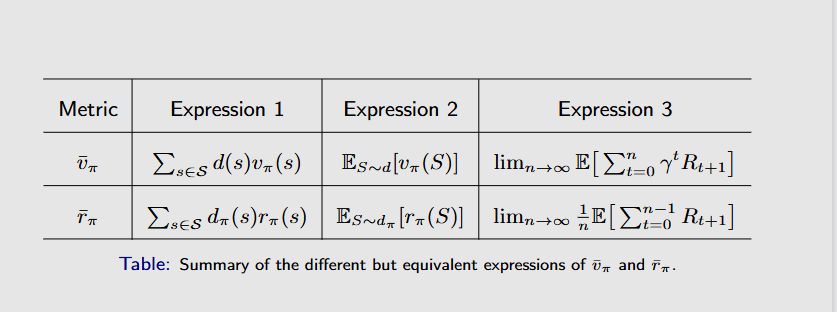
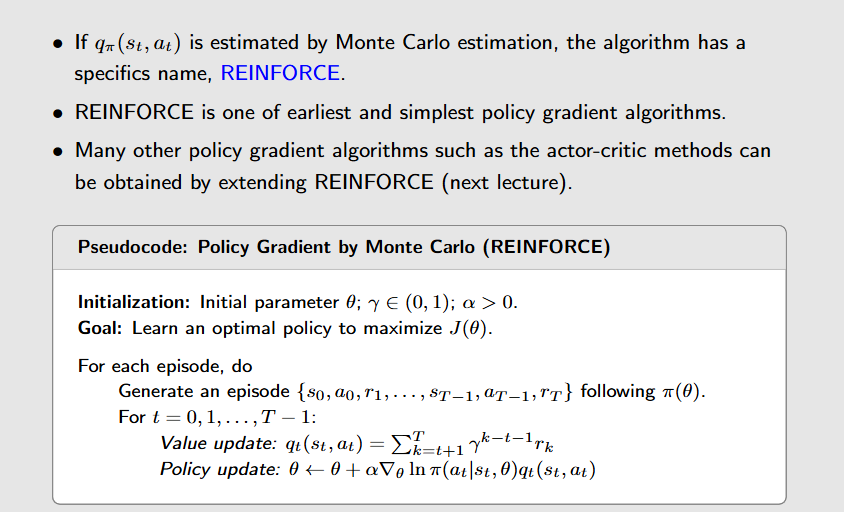

# The basic idea of policy gradient
之前介绍的deep Q-Learning是基于值函数的，而策略梯度方法则是直接根据策略来得到最优策略。 
与deep Q-Learning方法类似，策略梯度方法也可以使用梯度上升/下降方法优化。 

现在的问题是如何定义$J(\theta_t)$。

# Metric of define optimal policy

## Average Value

其中，$d(s)$的定义为stationary distribution，在前面几节已经介绍过了。 

可以使用$\bar{v}(s)$来当作$J(\theta_t)$，神经网络的目标是最大化$J(\theta_t)$。

## Average Reward

## 两种metric的对比

## The implementation of policy gradient

此外，还有一些对于$J(\theta_t)$的梯度求解方法以及相关分析，具体可以看ppt的解释。